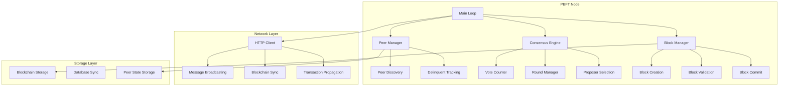
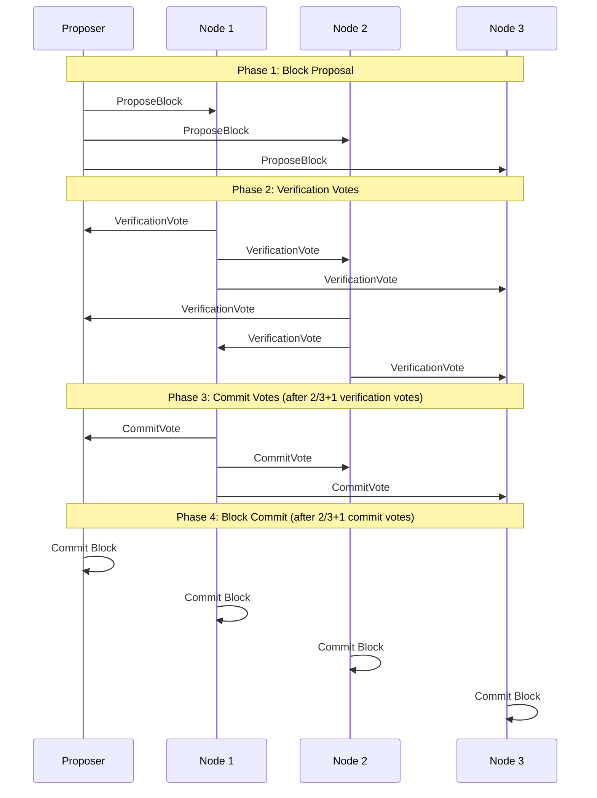

# Multi-Node PBFT Consensus Design Document

## Overview

This design document outlines the implementation of full multi-node Practical Byzantine Fault Tolerance (PBFT) consensus for the TinyWeb blockchain system. The current system operates as a single-node blockchain with stubbed consensus functions. This design will enable true distributed consensus across multiple nodes while maintaining the existing blockchain infrastructure and API endpoints.

The design leverages the existing HTTP API framework, cryptographic infrastructure, and blockchain data structures while implementing the missing peer communication, vote counting, and synchronization logic.

## Architecture

### High-Level Architecture



### PBFT Consensus Flow



## Components and Interfaces

### 1. Peer Management Component

**Purpose:** Manage peer discovery, connection tracking, and delinquent peer handling.

**Key Data Structures:**
```c
typedef struct {
    char ip[256];
    uint32_t id;
    unsigned char public_key[PUBKEY_SIZE];
    uint32_t delinquent_count;
    time_t last_seen;
    bool is_active;
} PeerInfo;

typedef struct {
    PeerInfo peers[MAX_PEERS];
    size_t peer_count;
    
    // Lookup maps for efficient peer resolution
    struct {
        uint32_t id;
        char ip[256];
    } id_ip_map[MAX_PEERS];
    
    struct {
        unsigned char public_key[PUBKEY_SIZE];
        char ip[256];
    } pkey_ip_map[MAX_PEERS];
    
    struct {
        unsigned char public_key[PUBKEY_SIZE];
        uint32_t id;
    } pkey_id_map[MAX_PEERS];
    
    size_t id_ip_count;
    size_t pkey_ip_count;
    size_t pkey_id_count;
} PeerManager;
```

**Key Functions:**
- `int pbft_node_load_peers_from_blockchain(PBFTNode* node)` - Load peers from blockchain transactions
- `int pbft_node_add_peer(PBFTNode* node, const unsigned char* public_key, const char* ip, uint32_t id)` - Add new peer
- `int pbft_node_mark_peer_delinquent(PBFTNode* node, uint32_t peer_id)` - Mark peer as delinquent
- `int pbft_node_is_peer_active(PBFTNode* node, uint32_t peer_id)` - Check if peer is active
- `void pbft_node_shuffle_peers(PBFTNode* node)` - Shuffle peer order to prevent bias

### 2. Vote Counting Component

**Purpose:** Track and count PBFT votes for consensus decisions.

**Key Data Structures:**
```c
typedef struct {
    char block_hash[HASH_HEX_SIZE];
    unsigned char voter_pubkeys[MAX_PEERS][PUBKEY_SIZE];
    char signatures[MAX_PEERS][SIGNATURE_SIZE * 2 + 1];
    uint32_t vote_count;
    time_t created_at;
} VoteTracker;

typedef struct {
    VoteTracker verification_votes[MAX_PENDING_BLOCKS];
    VoteTracker commit_votes[MAX_PENDING_BLOCKS];
    VoteTracker new_round_votes[MAX_PENDING_BLOCKS];
    
    int verification_count;
    int commit_count;
    int new_round_count;
} ConsensusState;
```

**Key Functions:**
- `int add_verification_vote(const char* block_hash, const unsigned char* voter_pubkey, const char* signature)`
- `int add_commit_vote(const char* block_hash, const unsigned char* voter_pubkey, const char* signature)`
- `bool has_sufficient_votes(const char* block_hash, VoteType vote_type)`
- `int calculate_vote_threshold(PBFTNode* node)` - Calculate 2/3 + 1 threshold
- `void clear_votes_for_block(const char* block_hash)` - Clean up after block commit

### 3. Network Communication Component

**Purpose:** Handle HTTP-based peer communication for consensus messages.

**Key Data Structures:**
```c
typedef struct {
    char* url;
    char* method;
    char* json_data;
    int timeout_ms;
    int retry_count;
} HttpRequest;

typedef struct {
    int status_code;
    char* response_body;
    size_t response_length;
    bool success;
} HttpResponse;
```

**Key Functions:**
- `HttpResponse* pbft_node_http_request(const char* url, const char* method, const char* json_data)`
- `int pbft_node_send_block_to_peer(PBFTNode* node, const char* peer_url, TW_Block* block, const char* block_hash)`
- `int pbft_node_send_verification_vote_to_peer(PBFTNode* node, const char* peer_url, const char* block_hash, const char* signature)`
- `int pbft_node_send_commit_vote_to_peer(PBFTNode* node, const char* peer_url, const char* block_hash, const char* signature)`
- `void pbft_node_free_http_response(HttpResponse* response)`

### 4. Blockchain Synchronization Component

**Purpose:** Keep blockchain state synchronized across all nodes.

**Key Functions:**
- `int pbft_node_get_blockchain_length_from_peer(PBFTNode* node, const char* peer_url)`
- `char* pbft_node_get_last_block_hash_from_peer(PBFTNode* node, const char* peer_url)`
- `int pbft_node_request_missing_blocks_from_peer(PBFTNode* node, const char* peer_url)`
- `int pbft_node_request_entire_blockchain_from_peer(PBFTNode* node, const char* peer_url)`
- `int pbft_node_sync_with_longest_chain(PBFTNode* node)`

### 5. Hybrid Serialization Component

**Purpose:** Handle both JSON and binary serialization for different message types.

**JSON Functions (for consensus messages):**
- `char* pbft_create_vote_json(const char* block_hash, const char* sender_pubkey, const char* signature, uint32_t round, const char* vote_type)`
- `char* pbft_create_sync_request_json(const char* last_hash, const char* sender_pubkey, const char* signature, const char* request_type)`
- `int pbft_parse_vote_json(const char* json_str, char* block_hash, char* sender_pubkey, char* signature, uint32_t* round, char* vote_type)`
- `int pbft_parse_sync_request_json(const char* json_str, char* last_hash, char* sender_pubkey, char* signature, char* request_type)`

**Binary + JSON Functions (for block data):**
- `char* pbft_serialize_block_to_base64(TW_Block* block)` - Convert binary block to base64 for JSON embedding
- `TW_Block* pbft_deserialize_block_from_base64(const char* base64_str)` - Convert base64 back to binary block
- `char* pbft_create_block_proposal_json(TW_Block* block, const char* block_hash, const char* sender_pubkey, const char* signature, uint32_t round)`
- `char* pbft_create_sync_response_json(TW_Block** blocks, int block_count, const char* blockchain_hash, const char* sender_pubkey, const char* signature)`

**Utility Functions:**
- `char* pbft_base64_encode(const unsigned char* data, size_t len)` - Base64 encoding for binary data
- `unsigned char* pbft_base64_decode(const char* base64_str, size_t* out_len)` - Base64 decoding

## Data Models

### Enhanced PBFTNode Structure

```c
typedef struct {
    NodeState base;  // Inherits from base node state
    
    // Network configuration
    char self_url[MAX_URL_LENGTH];
    uint16_t api_port;
    
    // Consensus state
    ConsensusState consensus;
    uint32_t current_round;
    time_t round_start_time;
    uint32_t round_timeout_ms;
    
    // Peer management
    PeerManager peer_manager;
    
    // Timing and performance
    uint32_t counter;
    time_t last_blockchain_save;
    int blockchain_has_progressed;
    uint32_t last_blockchain_length;
    
    // Threading
    pthread_t node_thread;
    pthread_t api_thread;
    pthread_mutex_t state_mutex;
    pthread_mutex_t consensus_mutex;
    int running;
    
    // Transaction queue management
    char pending_transaction_hashes[MAX_TRANSACTION_QUEUE][HASH_HEX_SIZE];
    int pending_transaction_count;
} PBFTNode;
```

### Serialization Strategy

**Hybrid Approach:**
- **JSON Serialization:** Used for consensus messages (votes, proposals, sync requests) for simplicity and debugging
- **Binary Serialization:** Used for blocks, transactions, and blockchain data for efficiency and existing compatibility

### Vote Message Format (JSON)

```json
{
    "blockHash": "abc123...",
    "sender": "public_key_hex",
    "signature": "signature_hex",
    "round": 123,
    "voteType": "verification|commit|new_round"
}
```

### Block Proposal Message Format (JSON + Binary)

```json
{
    "blockHash": "abc123...",
    "blockData": "base64_encoded_binary_block",
    "sender": "public_key_hex",
    "signature": "signature_hex",
    "round": 123
}
```

### Blockchain Sync Message Format (JSON)

```json
{
    "lastHash": "abc123...",
    "sender": "public_key_hex", 
    "signature": "signature_hex",
    "requestType": "missing_blocks|entire_blockchain|blockchain_length"
}
```

### Blockchain Sync Response Format (JSON + Binary)

```json
{
    "response": {
        "missingBlocks": [
            "base64_encoded_binary_block_1",
            "base64_encoded_binary_block_2"
        ]
    },
    "blockChainHash": "abc123...",
    "sender": "public_key_hex",
    "signature": "signature_hex"
}
```

## Error Handling

### Network Error Handling

1. **Connection Timeouts:** Implement exponential backoff with maximum retry limits
2. **Peer Unreachability:** Mark peers as delinquent after consecutive failures
3. **Message Corruption:** Validate JSON format and signatures before processing
4. **Network Partitions:** Continue operating with available peers, resync when partition heals

### Consensus Error Handling

1. **Insufficient Votes:** Trigger new round after timeout
2. **Conflicting Votes:** Mark sender as potentially Byzantine
3. **Invalid Block Proposals:** Reject and continue with next proposer
4. **Sync Failures:** Fall back to requesting entire blockchain

### Recovery Mechanisms

1. **Delinquent Peer Recovery:** Reset delinquent counter on successful communication
2. **Blockchain Desync:** Automatic resync with longest valid chain
3. **Round Timeout:** Increment proposer offset and start new round
4. **View Change:** Implement view change protocol for proposer failures

## Testing Strategy

### Unit Tests

1. **Peer Management Tests**
   - Test peer addition/removal
   - Test delinquent peer tracking
   - Test peer lookup functions

2. **Vote Counting Tests**
   - Test vote threshold calculations
   - Test duplicate vote detection
   - Test vote signature validation

3. **Network Communication Tests**
   - Test HTTP request/response handling
   - Test message serialization/deserialization
   - Test error handling and retries

4. **Blockchain Sync Tests**
   - Test missing block detection
   - Test blockchain length comparison
   - Test entire blockchain sync

### Integration Tests

1. **Multi-Node Consensus Tests**
   - Test 4-node network consensus
   - Test Byzantine fault tolerance (1 faulty node)
   - Test network partition scenarios

2. **Performance Tests**
   - Test consensus latency under normal conditions
   - Test throughput with high transaction volume
   - Test memory usage during extended operation

3. **Failure Recovery Tests**
   - Test node restart and rejoin
   - Test proposer failure and view change
   - Test blockchain desync recovery

### End-to-End Tests

1. **Family Network Simulation**
   - Test typical family network sizes (2-10 nodes)
   - Test node addition/removal during operation
   - Test transaction propagation across network

2. **Security Tests**
   - Test signature validation
   - Test Byzantine behavior detection
   - Test replay attack prevention

## Implementation Phases

### Phase 1: Core Infrastructure (Weeks 1-2)
- Implement HTTP client functionality
- Implement JSON serialization functions
- Implement basic peer management
- Update existing stub functions with basic implementations

### Phase 2: Vote Counting and Consensus (Weeks 3-4)
- Implement vote tracking data structures
- Implement vote counting logic
- Implement consensus decision making
- Add vote validation and signature checking

### Phase 3: Blockchain Synchronization (Weeks 5-6)
- Implement blockchain length comparison
- Implement missing block requests
- Implement entire blockchain sync
- Add conflict resolution logic

### Phase 4: Network Communication (Weeks 7-8)
- Implement peer-to-peer message broadcasting
- Implement transaction rebroadcasting
- Add error handling and retry logic
- Implement delinquent peer management

### Phase 5: Testing and Optimization (Weeks 9-10)
- Comprehensive unit testing
- Multi-node integration testing
- Performance optimization
- Security testing and hardening

## Security Considerations

### Message Authentication
- All consensus messages must be signed with Ed25519 signatures
- Signature verification must occur before message processing
- Invalid signatures result in message rejection and potential peer marking

### Byzantine Fault Tolerance
- System tolerates up to f = (n-1)/3 Byzantine nodes
- Duplicate votes from same peer are detected and rejected
- Conflicting votes result in peer being marked as potentially malicious

### Network Security
- Peer authentication during initial connection
- Replay attack prevention through message timestamps
- Rate limiting to prevent DoS attacks

### Data Integrity
- Block validation before acceptance
- Merkle tree verification for transaction integrity
- Blockchain hash chain validation during sync

## Performance Considerations

### Scalability Targets
- Support for 2-10 nodes (typical family network size)
- Consensus completion within 5-10 seconds under normal conditions
- Graceful degradation with network latency

### Memory Management
- Efficient vote tracking with automatic cleanup
- Bounded message queues to prevent memory leaks
- Periodic garbage collection of old consensus state

### Network Optimization
- Message batching where possible
- Compression for large blockchain sync operations
- Connection pooling for frequent peer communication

### Monitoring and Metrics
- Consensus round timing metrics
- Peer connectivity status tracking
- Vote counting and threshold monitoring
- Network partition detection and recovery logging